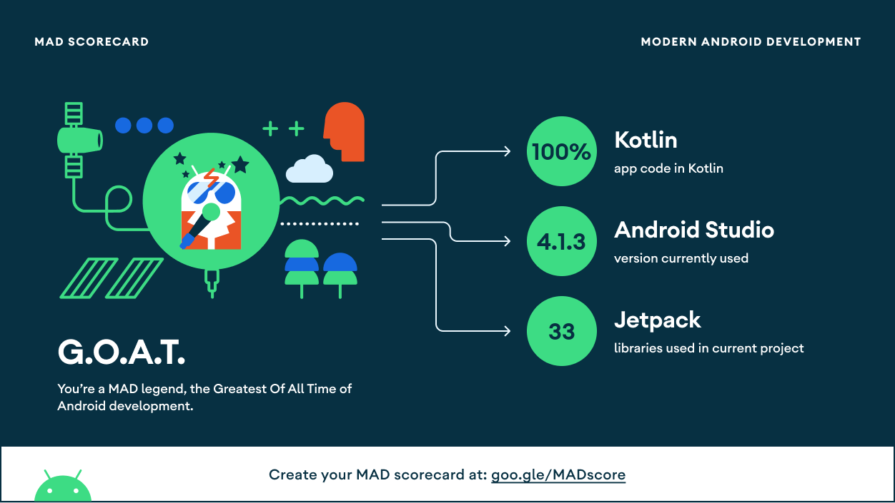

# JApp

JApp is a small demo application bases on Modern Android application tech-stacks and MVVM architecture. 
This project uses the new library Hilt of implementing dependency injection. 
Also fetching data from the network and integrating persisted data in the database via repository pattern.

## Preview

## Tech stack & Open-source libraries
- Minimum SDK level 21
- [Kotlin](https://kotlinlang.org/) based.
- [RxJava|RxAndroid](https://github.com/ReactiveX/RxAndroid) for asynchronous.
- Hilt (alpha) for dependency injection.
- JetPack
  - LiveData - notify domain layer data to views.
  - Lifecycle - dispose of observing data when lifecycle state changes.
  - ViewModel - UI related data holder, lifecycle aware.
  - View Binding.
- Architecture
  - MVVM Architecture (View - DataBinding - ViewModel - Model).
  - Repository pattern.
- [Retrofit2 & OkHttp3](https://github.com/square/retrofit) - construct the REST APIs and paging network data.
- [Moshi](https://github.com/square/moshi/) - A modern JSON library for Kotlin and Java.
- [Timber](https://github.com/JakeWharton/timber) - logging.
- [Skeleton](https://github.com/ethanhua/Skeleton) - skeleton animation

## Architecture
JApp is based on MVVM architecture and a repository pattern.

## [MAD Score](https://madscorecard.withgoogle.com/scorecards/3974416476/#summary)

